## Vegetation index (VI) extractions using RGB orthomosaic images</p></p>
Author: Leonardo Volpato</p>
Date: Last compiled on 16 December, 2022</p>

---------------------------------------------

### About this analysis 

The present analysis aims to perform the VIs extractions from the RGB images aka orthomosaic. </p>
Data source: Dry Beans Breeding Program - MSU. </p>
Principal Investigator: [Dr. Francisco Gomez](https://www.canr.msu.edu/people/francisco-gomez) 


<p align="center">
    
</p>

---------------------------------------------

---------------------------------------------

## Resources

* [Basic pipeline]
* [Getting started - Complete data set]
   * [Running the loops]
   * [Adjusting the results and saving]


---------------------------------------------


## Setting up the working directory 


```r
rm(list=ls())
my.path <- dirname(rstudioapi::getActiveDocumentContext()$path)
setwd(my.path)
```

## Load and install necessary Packages  


```r
# if(!require(pacman)) install.packages(pacman)
# 
# pacman::p_load(
#                     sp,
#                     #raster,
#                     terra,
#                     rgdal,
#                     ggplot2,
#                     agricolae,
#                     reshape2,
#                     devtools,
#                     ggrepel,
#                     lme4,
#                     plyr,
#                     DescTools,
#                     doParallel,
#                     parallel,
#                     foreach,
#                     maptools,
#                     spatialEco,
#                     attempt,
#                     igraph,
#                     config,
#                     BiocManager,
#                     EBImage,
#                     FIELDimageR,
#                     tidyr
# ) 
```


# Basic pipeline

## Setting the work directories
| A example soybean files will be used to perform this introduction pipeline. As reference see [Volpato et al. 2021](G:\Shared drives\Bean_Lab\Volpato\R_script\Example_drone_data_soy)
* The example data contain: 2 orthomosaic and a shapefile with 48 plots in total.

### Folder directory containing the orthomosaics


```r
dir_ortho <- "/MOSAIC"
dir_ortho <- paste(my.path,dir_ortho, sep="")
print(dir_ortho)
#> [1] "G:/Shared drives/Bean_Lab/Volpato/R_script/Phenotyping-drones-img/VIs/VIs_RGB_v2/Workshop_01_VIs/MOSAIC"
```

### Folder directory containing the shapefiles


```r
folder_shp <- "./Shapefile"
```

## Getting the files


```r
imgFiles <-list.files(path = dir_ortho, pattern="*.tif$",full.names = T) #get the Orthosaics. 
imgFiles #Files that their name ends in group1.tif (Change all file names to otimization)
#> [1] "G:/Shared drives/Bean_Lab/Volpato/R_script/Phenotyping-drones-img/VIs/VIs_RGB_v2/Workshop_01_VIs/MOSAIC/WA_2018_08_15.tif"
#> [2] "G:/Shared drives/Bean_Lab/Volpato/R_script/Phenotyping-drones-img/VIs/VIs_RGB_v2/Workshop_01_VIs/MOSAIC/WA_2018_08_23.tif"

imgFiles_name <-list.files(path = dir_ortho, pattern="*.tif$") # Aux file names
imgFiles_name <- gsub(".tif", "", imgFiles_name, ignore.case = FALSE, perl = FALSE, fixed = TRUE, useBytes = FALSE) # Removing the extension
imgFiles_name
#> [1] "WA_2018_08_15" "WA_2018_08_23"
```


## Loading and Reading the plots Shapefile


```r
# Loading the shape files
layer_prefix_shp <- "Export_Output" # name with the .shp extension
## Read the plots Shapefile
#indPlots <- readOGR(dsn = folder_shp, layer = layer_prefix_shp)
indPlots <- vect( folder_shp, layer = layer_prefix_shp)

## Polygon plot ID list from the shapefiles
names(indPlots)
#> [1] "Range2"     "Row2"       "Test"       "Entry"      "MNPlot"     "RM"        
#> [7] "RM_list"    "RepNo"      "MaturityDa"
```

## Getting the RGB bands


```r
#img_ortho <- imgFiles[1]
img.rgb.1 <- rast(imgFiles[1])
img.rgb.1
#> class       : SpatRaster 
#> dimensions  : 1582, 836, 4  (nrow, ncol, nlyr)
#> resolution  : 0.02535, 0.02535  (x, y)
#> extent      : 457926.1, 457947.2, 4880222, 4880262  (xmin, xmax, ymin, ymax)
#> coord. ref. : WGS 84 / UTM zone 15N (EPSG:32615) 
#> source      : WA_2018_08_15.tif 
#> names       : WA_2018_08_15_1, WA_2018_08_15_2, WA_2018_08_15_3, WA_2018_08_15_4 
#> min values  :              36,              40,               1,             255 
#> max values  :             254,             252,             225,             255
```

## Ploting the field maps and shapefile

```r
plotRGB(img.rgb.1)

plot(indPlots,add=T,col="red") # merge the external shp file and orthomosaic
```

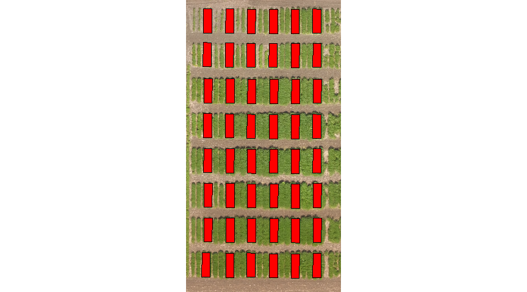<!-- -->

## Reducing the image resoution if necessary


```r
img.rgb.2<-aggregate(img.rgb.1, fact=4) ## reducing the resoluation. Using high numbers for fact is not desired. 
```

## Cropping the plot image


```r
plot_crop_idx_1 <- crop(img.rgb.1,ext(indPlots[1,]))
```

## Plotting the plot image


```r
plotRGB(plot_crop_idx_1)
```

<!-- -->

## Building vegetation indices
* The R package `FIELDimageR` will be used to perform this step. Referene: [Filipe Matias](https://github.com/OpenDroneMap/FIELDimageR/blob/master/README.md)


```r
img.index <- fieldIndex(mosaic = plot_crop_idx_1, index = c("BI", "GLI", "HI", "NGRDI", "BGI", "VARI", "SCI")) 
#> [1] "4 layers available"
```

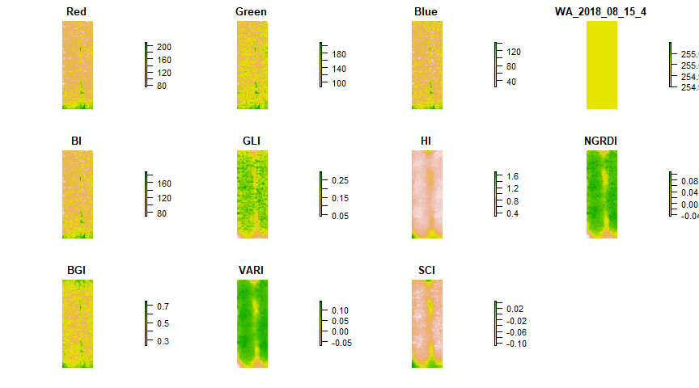<!-- -->


```r
plot(img.index$NGRDI)
```

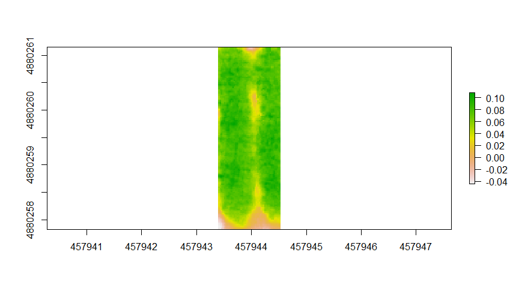<!-- -->


## Removing the soil
* The R package `FIELDimageR` will be used to perform this step.
* Choosing the best index to build a mask for RGB
* This is a trick analysis to run, but this criteria is up to the research to pick one threshold and VIs


```r
EX.Mask1 <- fieldMask(mosaic = plot_crop_idx_1, index = "NGRDI", cropValue = 0.05, cropAbove = F)
#> [1] "4 layers available"
```

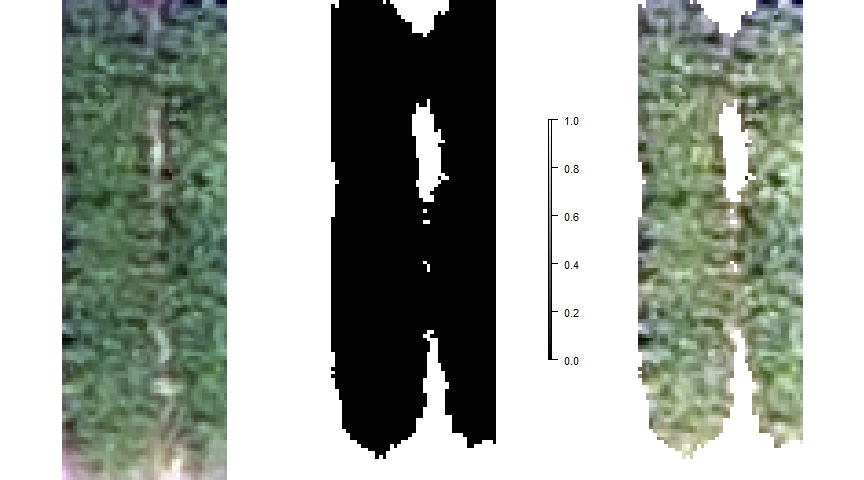<!-- -->


```r

EX.Mask3 <- fieldMask(mosaic = plot_crop_idx_1, index = "HI", cropValue = 0.6, cropAbove = T) #all values above the cropValue will be accounted to make the mask.
#> [1] "4 layers available"
```

<!-- -->


```r

EX.Mask4 <- fieldMask(mosaic = plot_crop_idx_1, index = "HI", cropValue = 0.8, cropAbove = T)
#> [1] "4 layers available"
```

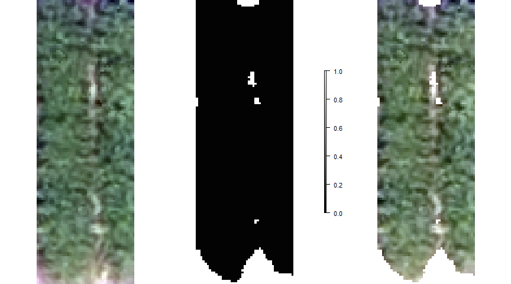<!-- -->


```r
EX.Mask5 <- fieldMask(mosaic = plot_crop_idx_1, index = "HI", cropValue = 0.6, cropAbove = T) ## This model will be select to perform the analysis
#> [1] "4 layers available"
```

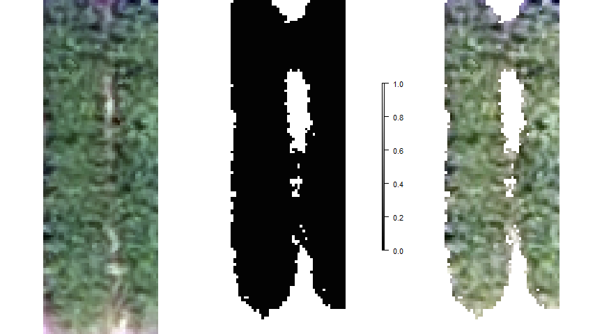<!-- -->


##  Building vegetation indices


```r
#Investigating the raw image plot
img.index.hi <- fieldIndex(mosaic = plot_crop_idx_1, index = c("HI") )
#> [1] "4 layers available"
```

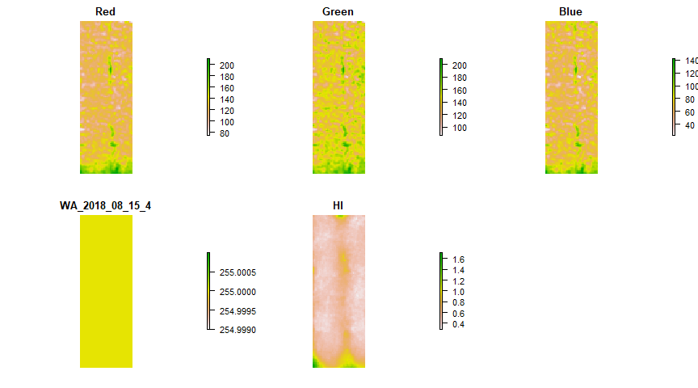<!-- -->


```r
hist(img.index.hi$HI) # Image segmentation start from 0.7 (soil and plants)
```

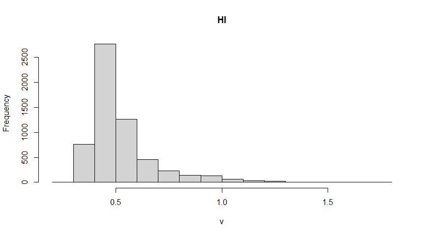<!-- -->


```r

#Investigating the clean image plot
img.index.hi.clean <- fieldIndex(mosaic = EX.Mask5$newMosaic, index = c("HI") )
#> [1] "4 layers available"
```

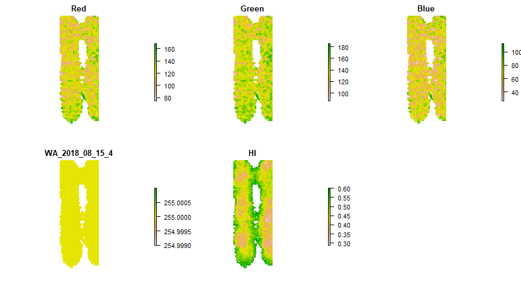<!-- -->


```r
hist(img.index.hi.clean$HI) # Image segmentation start from 0.7 (soil and plants)
```

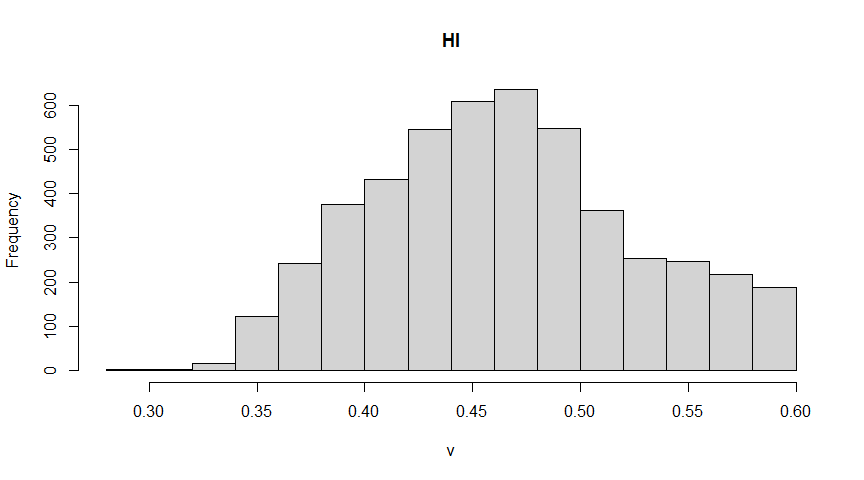<!-- -->

## Orthomosaic image


```r
ortho.index.hi.clean<- fieldIndex(mosaic = img.rgb.1, index = c("HI"))
#> [1] "4 layers available"
```

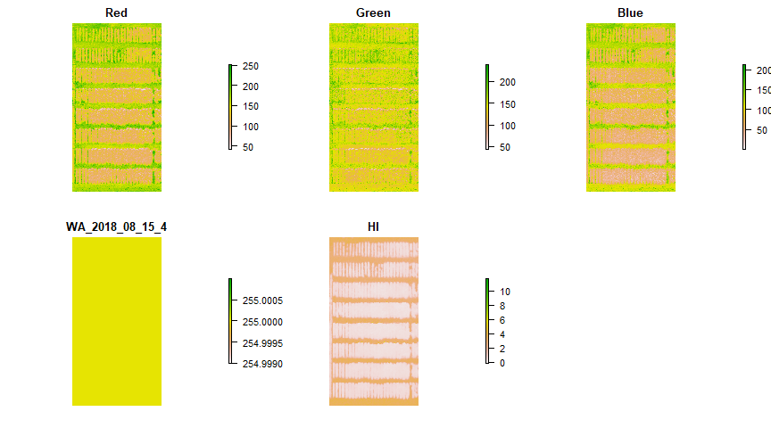<!-- -->


```r
#dev.off()

ortho.HI.RemSoil<- fieldMask(mosaic = img.rgb.1, Red = 1, Green = 2, Blue = 3, 
                   index = "HI", cropValue = 0.7, cropAbove = T) 
#> [1] "4 layers available"
```

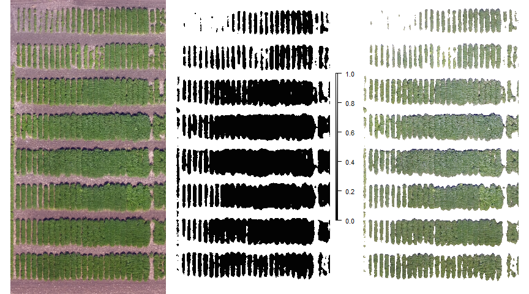<!-- -->


## Extracting the pixels values


```r

##Selection the VI from the clean orthomosaic
Veg.Indices<-fieldIndex(mosaic = ortho.HI.RemSoil$newMosaic,
                        index=c("GLI"))
#> [1] "4 layers available"
```

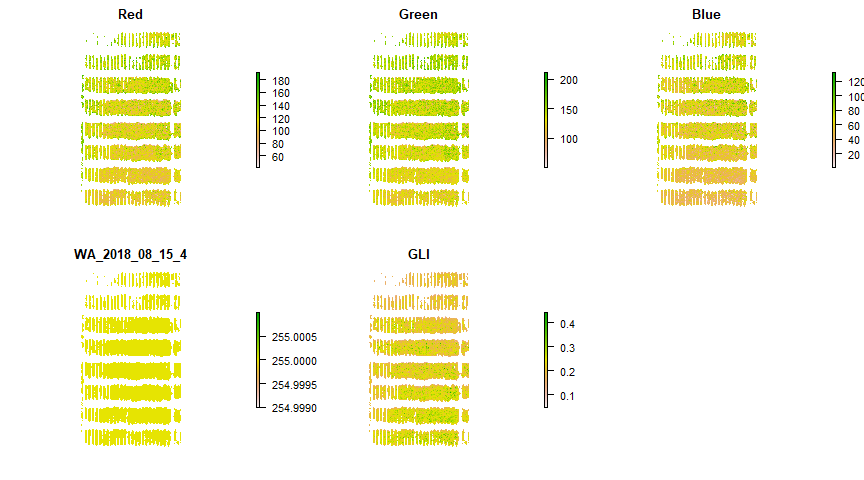<!-- -->


```r

## Read the plots Shapefile
indPlots <- readOGR(dsn = folder_shp, layer = layer_prefix_shp)
#> OGR data source with driver: ESRI Shapefile 
#> Source: "G:\Shared drives\Bean_Lab\Volpato\R_script\Phenotyping-drones-img\VIs\VIs_RGB_v2\Workshop_01_VIs\Shapefile", layer: "Export_Output"
#> with 48 features
#> It has 9 fields
#indPlots <- read_sf(dsn = folder_shp, layer = layer_prefix_shp)

## Conf. the CRS projections
projection(indPlots)<-projection(Veg.Indices) ##Makes coordinate system of .tif with indices and without soil and .shp the same


ortho.Info1<-fieldInfo(mosaic=Veg.Indices,
                     fieldShape=indPlots,
                     n.core=10) ## Extracts all vegetation indices (layers) for each .shp file
#> [1] "Extracting: 5 layers."
#> [1] "You can speed up this step using n.core=12 or less."

VI_data<- dplyr::as_tibble(ortho.Info1$fieldShape@data)

write.csv(VI_data, "VI_data_GLI.csv",  row.names=F) 

hist(ortho.Info1$fieldShape$GLI)
```

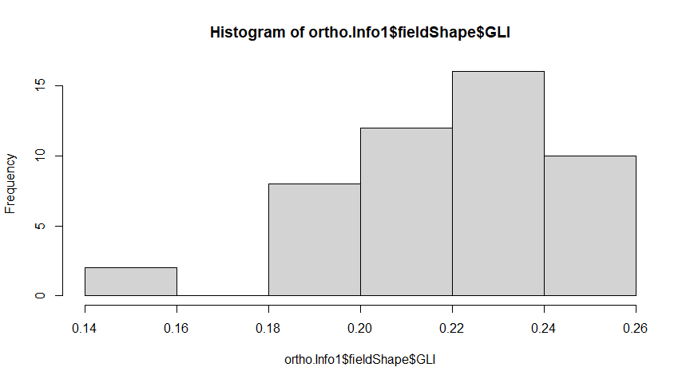<!-- -->


## Graphic visualization of trait values for each plot using the fieldShape file and the orthomosaic


```r
#names(indPlots)
### Interpolating colors: c("white","black")
fieldPlot(fieldShape=ortho.Info1$fieldShape,fieldAttribute="MaturityDa", mosaic=Veg.Indices, color=c("white","black"), alpha = 0.5)
```

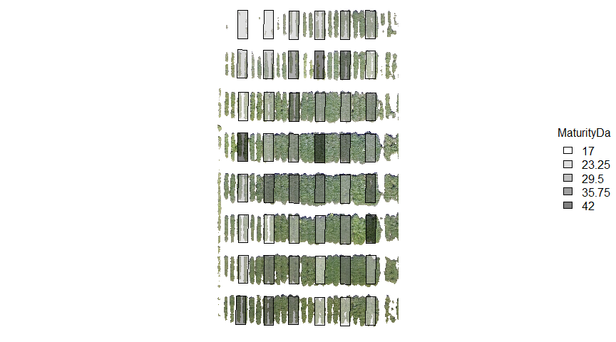<!-- -->

```r

### Interpolating colors: c("red","blue")
fieldPlot(fieldShape=ortho.Info1$fieldShape,fieldAttribute="GLI", mosaic=Veg.Indices, color=c("red","blue"), alpha = 0.5)
```

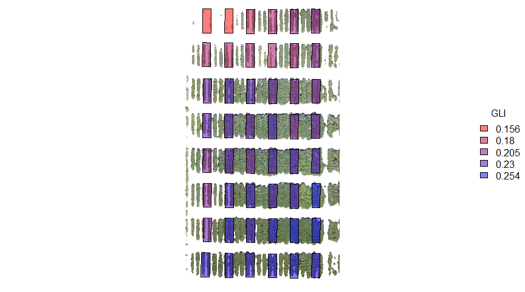<!-- -->


---------------------------------------------

## Getting started - Complete data set

This code will run across of 4 type of loops:
* Flgith date (orthomosaic) **i**
* Vegetation index (VIs) **v**
* Function of pixel value extraction **f**
* Plot ID **p**

**ATTENTION**
- This script will run using the [parallel function](https://stat.ethz.ch/R-manual/R-devel/library/parallel/doc/parallel.pdf) to improve the computer capacity, however, be aware that you computer will be dedicated only for this analysis. To avoid any crash, reduce the number of cores to -2 from your total number. \n
\n


## Setting up the working directory 


```r
rm(list=ls())
my.path <- dirname(rstudioapi::getActiveDocumentContext()$path)
setwd(my.path)
```

# Setting the work directories

## Folder directory containing the orthomosaics


```r
dir_ortho <- "/MOSAIC"
dir_ortho <- paste(my.path,dir_ortho, sep="")
print(dir_ortho)
#> [1] "G:/Shared drives/Bean_Lab/Volpato/R_script/Phenotyping-drones-img/VIs/VIs_RGB_v2/Workshop_01_VIs/MOSAIC"
```

## Folder directory containing the shapefiles


```r
folder_shp <- "./Shapefile"
```

# Getting the files


```r
imgFiles <-list.files(path = dir_ortho, pattern="*.tif$",full.names = T) #get the Orthosaics. 
imgFiles #Files that their name ends in group1.tif (Change all file names to otimization)
#> [1] "G:/Shared drives/Bean_Lab/Volpato/R_script/Phenotyping-drones-img/VIs/VIs_RGB_v2/Workshop_01_VIs/MOSAIC/WA_2018_08_15.tif"
#> [2] "G:/Shared drives/Bean_Lab/Volpato/R_script/Phenotyping-drones-img/VIs/VIs_RGB_v2/Workshop_01_VIs/MOSAIC/WA_2018_08_23.tif"

imgFiles_name <-list.files(path = dir_ortho, pattern="*.tif$") # Aux file names
imgFiles_name <- gsub(".tif", "", imgFiles_name, ignore.case = FALSE, perl = FALSE, fixed = TRUE, useBytes = FALSE) # Removing the extension
imgFiles_name
#> [1] "WA_2018_08_15" "WA_2018_08_23"
```


# Loading and Reading the plots Shapefile


```r
# Loading the shape files
layer_prefix_shp <- "Export_Output" # name with the .shp extension
## Read the plots Shapefile
#indPlots <- readOGR(dsn = folder_shp, layer = layer_prefix_shp)
indPlots <- readOGR( folder_shp, layer = layer_prefix_shp)
#> OGR data source with driver: ESRI Shapefile 
#> Source: "G:\Shared drives\Bean_Lab\Volpato\R_script\Phenotyping-drones-img\VIs\VIs_RGB_v2\Workshop_01_VIs\Shapefile", layer: "Export_Output"
#> with 48 features
#> It has 9 fields

## Polygon plot ID list from the shapefiles
names(indPlots)
#> [1] "Range2"     "Row2"       "Test"       "Entry"      "MNPlot"     "RM"        
#> [7] "RM_list"    "RepNo"      "MaturityDa"

# Subsetting plots to speed up the loop
indPlots<- indPlots[1:5,"MNPlot"]
indPlots
#> class       : SpatialPolygonsDataFrame 
#> features    : 5 
#> extent      : 457931.5, 457944.5, 4880257, 4880261  (xmin, xmax, ymin, ymax)
#> crs         : +proj=utm +zone=15 +datum=WGS84 +units=m +no_defs 
#> variables   : 1
#> names       : MNPlot 
#> min values  : 264001 
#> max values  : 264033
```

# Setting the parameters from the loop

## Plots ID


```r
## Data frame with plot names
Plot_ID<- as.data.frame(indPlots[,"MNPlot"])
indPlots # Plot identification propose
#> class       : SpatialPolygonsDataFrame 
#> features    : 5 
#> extent      : 457931.5, 457944.5, 4880257, 4880261  (xmin, xmax, ymin, ymax)
#> crs         : +proj=utm +zone=15 +datum=WGS84 +units=m +no_defs 
#> variables   : 1
#> names       : MNPlot 
#> min values  : 264001 
#> max values  : 264033
```

## VIs list
* The VIs list will be imported from a separated R script in order to the script maximization


```r
## Import the functions file
source("VIs_RGB-aux.R")

#Reading 38 VIs from RGB image
myIndex_list<- myIndex_list
myIndex_list_name<- myIndex_list_name
```

## Functions of extractions


```r
func_list<- c('mean', 'median') # "sd
# There are many other functions (SD, VAR, Quantiles, etc)
```


## Starting the parallel function
Please, take your time and study how this function works and if this function is for you.


```r
gc() #Cleaning unusual memmory
#>           used  (Mb) gc trigger  (Mb) max used  (Mb)
#> Ncells 4579540 244.6    8014052 428.0  8014052 428.0
#> Vcells 6658941  50.9   23408984 178.6 45720669 348.9

# Number of cores
n.core<-detectCores() # or detectCores()

# Starting parallel
cl <- makeCluster(n.core, output = "")
registerDoParallel(cl)
getDoParWorkers()
#> [1] 12
```


## Running the loops

- This loop can take up to 5* min to complete
- * See the computer resources restrictions


```r
## Using the code inside the system time to get the total time used.
system.time(
  for(i in 1:length(imgFiles)){ #loop through images

    message("Processing ortho: ",paste(imgFiles_name[i]))
    #i.h<-aggregate(stack(imgFiles[k]), fact=aggregateCells) to reduce the image size if the case
    i.h <-  stack(imgFiles[i])
   
    for(v in 1:length(myIndex_list)){ #loop through VIs
  
      message("Using VI: ",paste(myIndex_list_name[v]))
      
      for(f in 1:length(func_list)){  #loop through extractions functions
       
        message("Using function: ",paste(func_list[f]))
      
  results<- foreach(p = 1:length(indPlots),  #loop through plots numbers
                     .packages = c("raster", "FIELDimageR"), 
                     .combine = rbind) %dopar% {
                      
    # Step 1: crop the plot from the orthomosaci
    h.c <-  crop(i.h, extent(indPlots[p,]))
    
    # Step 2: remove the soil using the HUE VI with a threshold = 0.6
    m.h <-  fieldMask(mosaic=h.c,
                           Red=1,
                           Green=2,
                           Blue=3,
                           index="HUE",
                           cropValue=0.6, #or 0.6 | 0.8
                           cropAbove=T, ## Removes any instance of soil from tif file
                           plot = FALSE) 
    
    # Step 3: Obtain the VI from the vegetation only
    Veg.Indices<-fieldIndex(mosaic = m.h$newMosaic, myIndex=myIndex_list[v],
    plot = FALSE)
    
    projection(indPlots)<-projection(Veg.Indices)
    
    # Step 4: Extraction the pixel value from each individual plot using the function 
     raster::extract(x = Veg.Indices$myIndex, y = indPlots[p,], fun = eval(parse(text = func_list[f])),  
            buffer = buffer, na.rm = T, df = T)
     
                     }
  
       results$Func<-func_list[f]
  
    # Step 5: Saving the results into a data frame with the lenght of the Plots ID
       results$ID <- 1:length(indPlots)
  
  if(f==1){results.1<-results}else{results.1<-rbind(results.1, results)}
  
      }
      
    # Step 6: Saving the vegetation index name for each function
      results.1$VIs<-myIndex_list_name[v]
  
     if(v==1){results.2<-results.1}else{results.2<-rbind(results.2, results.1)}

    }
    
    # # Step 6: Saving the vegetation index name from each function for each orthomosaic
      results.2$imgFiles_name<-imgFiles_name[i]
      
        if(i==1){results.3<-results.2}else{results.3<-rbind(results.3, results.2)}
    
  })
#>    user  system elapsed 
#>    1.60    1.09  145.23

parallel::stopCluster(cl) # Stopping the parallel function


###### the end ###########
```


## Adjusting the results and saving


```r
as_tibble(results.3) # Saving into a table
```

<div class="kable-table">

| ID|      myIndex|Func   |VIs         |imgFiles_name |
|--:|------------:|:------|:-----------|:-------------|
|  1|  114.9137065|mean   |BI          |WA_2018_08_15 |
|  2|  117.8167882|mean   |BI          |WA_2018_08_15 |
|  3|  118.7206208|mean   |BI          |WA_2018_08_15 |
|  4|  119.6909758|mean   |BI          |WA_2018_08_15 |
|  5|  134.2669836|mean   |BI          |WA_2018_08_15 |
|  1|  114.0701535|median |BI          |WA_2018_08_15 |
|  2|  116.3127967|median |BI          |WA_2018_08_15 |
|  3|  118.2553734|median |BI          |WA_2018_08_15 |
|  4|  119.5226617|median |BI          |WA_2018_08_15 |
|  5|  134.3366418|median |BI          |WA_2018_08_15 |
|  1|   14.8269631|mean   |BIM         |WA_2018_08_15 |
|  2|   15.0217889|mean   |BIM         |WA_2018_08_15 |
|  3|   15.1032322|mean   |BIM         |WA_2018_08_15 |
|  4|   15.1978087|mean   |BIM         |WA_2018_08_15 |
|  5|   16.1635149|mean   |BIM         |WA_2018_08_15 |
|  1|   14.7873820|median |BIM         |WA_2018_08_15 |
|  2|   14.9443412|median |BIM         |WA_2018_08_15 |
|  3|   15.0775772|median |BIM         |WA_2018_08_15 |
|  4|   15.1877143|median |BIM         |WA_2018_08_15 |
|  5|   16.1864141|median |BIM         |WA_2018_08_15 |
|  1|   -0.0704816|mean   |SCI         |WA_2018_08_15 |
|  2|   -0.0605880|mean   |SCI         |WA_2018_08_15 |
|  3|   -0.0503409|mean   |SCI         |WA_2018_08_15 |
|  4|   -0.0517345|mean   |SCI         |WA_2018_08_15 |
|  5|   -0.0197081|mean   |SCI         |WA_2018_08_15 |
|  1|   -0.0757576|median |SCI         |WA_2018_08_15 |
|  2|   -0.0671378|median |SCI         |WA_2018_08_15 |
|  3|   -0.0553506|median |SCI         |WA_2018_08_15 |
|  4|   -0.0575540|median |SCI         |WA_2018_08_15 |
|  5|   -0.0175439|median |SCI         |WA_2018_08_15 |
|  1|    0.1995143|mean   |GLI         |WA_2018_08_15 |
|  2|    0.1901689|mean   |GLI         |WA_2018_08_15 |
|  3|    0.1791316|mean   |GLI         |WA_2018_08_15 |
|  4|    0.1724717|mean   |GLI         |WA_2018_08_15 |
|  5|    0.1298501|mean   |GLI         |WA_2018_08_15 |
|  1|    0.2025586|median |GLI         |WA_2018_08_15 |
|  2|    0.1945701|median |GLI         |WA_2018_08_15 |
|  3|    0.1830986|median |GLI         |WA_2018_08_15 |
|  4|    0.1779141|median |GLI         |WA_2018_08_15 |
|  5|    0.1285732|median |GLI         |WA_2018_08_15 |
|  1|    0.5117505|mean   |HI          |WA_2018_08_15 |
|  2|    0.5739090|mean   |HI          |WA_2018_08_15 |
|  3|    0.6357637|mean   |HI          |WA_2018_08_15 |
|  4|    0.6091133|mean   |HI          |WA_2018_08_15 |
|  5|    0.8255476|mean   |HI          |WA_2018_08_15 |
|  1|    0.4750000|median |HI          |WA_2018_08_15 |
|  2|    0.5263158|median |HI          |WA_2018_08_15 |
|  3|    0.5937500|median |HI          |WA_2018_08_15 |
|  4|    0.5675676|median |HI          |WA_2018_08_15 |
|  5|    0.8360656|median |HI          |WA_2018_08_15 |
|  1|    0.0704816|mean   |NGRDI       |WA_2018_08_15 |
|  2|    0.0605880|mean   |NGRDI       |WA_2018_08_15 |
|  3|    0.0503409|mean   |NGRDI       |WA_2018_08_15 |
|  4|    0.0517345|mean   |NGRDI       |WA_2018_08_15 |
|  5|    0.0197081|mean   |NGRDI       |WA_2018_08_15 |
|  1|    0.0757576|median |NGRDI       |WA_2018_08_15 |
|  2|    0.0671378|median |NGRDI       |WA_2018_08_15 |
|  3|    0.0553506|median |NGRDI       |WA_2018_08_15 |
|  4|    0.0575540|median |NGRDI       |WA_2018_08_15 |
|  5|    0.0175439|median |NGRDI       |WA_2018_08_15 |
|  1|    0.3022752|mean   |SI          |WA_2018_08_15 |
|  2|    0.3028373|mean   |SI          |WA_2018_08_15 |
|  3|    0.2996707|mean   |SI          |WA_2018_08_15 |
|  4|    0.2781875|mean   |SI          |WA_2018_08_15 |
|  5|    0.2488343|mean   |SI          |WA_2018_08_15 |
|  1|    0.3000000|median |SI          |WA_2018_08_15 |
|  2|    0.3010753|median |SI          |WA_2018_08_15 |
|  3|    0.2984293|median |SI          |WA_2018_08_15 |
|  4|    0.2777778|median |SI          |WA_2018_08_15 |
|  5|    0.2468619|median |SI          |WA_2018_08_15 |
|  1|    0.0936563|mean   |VARI        |WA_2018_08_15 |
|  2|    0.0804949|mean   |VARI        |WA_2018_08_15 |
|  3|    0.0672337|mean   |VARI        |WA_2018_08_15 |
|  4|    0.0701976|mean   |VARI        |WA_2018_08_15 |
|  5|    0.0276502|mean   |VARI        |WA_2018_08_15 |
|  1|    0.1009615|median |VARI        |WA_2018_08_15 |
|  2|    0.0896226|median |VARI        |WA_2018_08_15 |
|  3|    0.0744186|median |VARI        |WA_2018_08_15 |
|  4|    0.0781250|median |VARI        |WA_2018_08_15 |
|  5|    0.0249378|median |VARI        |WA_2018_08_15 |
|  1|   -1.5584950|mean   |HUE         |WA_2018_08_15 |
|  2|   -1.5410074|mean   |HUE         |WA_2018_08_15 |
|  3|   -1.5347821|mean   |HUE         |WA_2018_08_15 |
|  4|   -1.5351893|mean   |HUE         |WA_2018_08_15 |
|  5|   -1.4234278|mean   |HUE         |WA_2018_08_15 |
|  1|   -1.5667832|median |HUE         |WA_2018_08_15 |
|  2|   -1.5664205|median |HUE         |WA_2018_08_15 |
|  3|   -1.5657799|median |HUE         |WA_2018_08_15 |
|  4|   -1.5658225|median |HUE         |WA_2018_08_15 |
|  5|   -1.5568064|median |HUE         |WA_2018_08_15 |
|  1|    0.4675605|mean   |BdivG       |WA_2018_08_15 |
|  2|    0.4766734|mean   |BdivG       |WA_2018_08_15 |
|  3|    0.4895181|mean   |BdivG       |WA_2018_08_15 |
|  4|    0.5112599|mean   |BdivG       |WA_2018_08_15 |
|  5|    0.5799225|mean   |BdivG       |WA_2018_08_15 |
|  1|    0.4662162|median |BdivG       |WA_2018_08_15 |
|  2|    0.4718310|median |BdivG       |WA_2018_08_15 |
|  3|    0.4844720|median |BdivG       |WA_2018_08_15 |
|  4|    0.5037037|median |BdivG       |WA_2018_08_15 |
|  5|    0.5816298|median |BdivG       |WA_2018_08_15 |
|  1|    0.1996195|mean   |BCC         |WA_2018_08_15 |
|  2|    0.2011394|mean   |BCC         |WA_2018_08_15 |
|  3|    0.2039526|mean   |BCC         |WA_2018_08_15 |
|  4|    0.2113883|mean   |BCC         |WA_2018_08_15 |
|  5|    0.2278412|mean   |BCC         |WA_2018_08_15 |
|  1|    0.2000000|median |BCC         |WA_2018_08_15 |
|  2|    0.2007299|median |BCC         |WA_2018_08_15 |
|  3|    0.2035928|median |BCC         |WA_2018_08_15 |
|  4|    0.2105263|median |BCC         |WA_2018_08_15 |
|  5|    0.2285714|median |BCC         |WA_2018_08_15 |
|  1|  -15.9262572|mean   |CIVE        |WA_2018_08_15 |
|  2|  -14.8291669|mean   |CIVE        |WA_2018_08_15 |
|  3|  -13.1659306|mean   |CIVE        |WA_2018_08_15 |
|  4|  -12.2179017|mean   |CIVE        |WA_2018_08_15 |
|  5|   -6.4868888|mean   |CIVE        |WA_2018_08_15 |
|  1|  -16.8230500|median |CIVE        |WA_2018_08_15 |
|  2|  -15.9815500|median |CIVE        |WA_2018_08_15 |
|  3|  -14.5725500|median |CIVE        |WA_2018_08_15 |
|  4|  -13.4695500|median |CIVE        |WA_2018_08_15 |
|  5|   -5.7420500|median |CIVE        |WA_2018_08_15 |
|  1|  140.5984143|mean   |COM1        |WA_2018_08_15 |
|  2|  132.7955379|mean   |COM1        |WA_2018_08_15 |
|  3|  123.1801603|mean   |COM1        |WA_2018_08_15 |
|  4|  119.4516626|mean   |COM1        |WA_2018_08_15 |
|  5|   82.9443858|mean   |COM1        |WA_2018_08_15 |
|  1|  146.3399496|median |COM1        |WA_2018_08_15 |
|  2|  139.9980389|median |COM1        |WA_2018_08_15 |
|  3|  129.8206918|median |COM1        |WA_2018_08_15 |
|  4|  126.3650537|median |COM1        |WA_2018_08_15 |
|  5|   79.1198829|median |COM1        |WA_2018_08_15 |
|  1|   26.2387044|mean   |COM2        |WA_2018_08_15 |
|  2|   25.8712003|mean   |COM2        |WA_2018_08_15 |
|  3|   25.2156828|mean   |COM2        |WA_2018_08_15 |
|  4|   24.7585448|mean   |COM2        |WA_2018_08_15 |
|  5|   22.6451112|mean   |COM2        |WA_2018_08_15 |
|  1|   26.5839243|median |COM2        |WA_2018_08_15 |
|  2|   26.3306527|median |COM2        |WA_2018_08_15 |
|  3|   25.8303359|median |COM2        |WA_2018_08_15 |
|  4|   25.2445524|median |COM2        |WA_2018_08_15 |
|  5|   22.3534975|median |COM2        |WA_2018_08_15 |
|  1|   93.0097425|mean   |ExG         |WA_2018_08_15 |
|  2|   90.5693835|mean   |ExG         |WA_2018_08_15 |
|  3|   86.5920610|mean   |ExG         |WA_2018_08_15 |
|  4|   84.0929146|mean   |ExG         |WA_2018_08_15 |
|  5|   70.7921914|mean   |ExG         |WA_2018_08_15 |
|  1|   95.0000000|median |ExG         |WA_2018_08_15 |
|  2|   93.0000000|median |ExG         |WA_2018_08_15 |
|  3|   90.0000000|median |ExG         |WA_2018_08_15 |
|  4|   87.0000000|median |ExG         |WA_2018_08_15 |
|  5|   69.0000000|median |ExG         |WA_2018_08_15 |
|  1|    0.2854106|mean   |ExG2        |WA_2018_08_15 |
|  2|    0.2712235|mean   |ExG2        |WA_2018_08_15 |
|  3|    0.2544672|mean   |ExG2        |WA_2018_08_15 |
|  4|    0.2444021|mean   |ExG2        |WA_2018_08_15 |
|  5|    0.1812221|mean   |ExG2        |WA_2018_08_15 |
|  1|    0.2896341|median |ExG2        |WA_2018_08_15 |
|  2|    0.2774194|median |ExG2        |WA_2018_08_15 |
|  3|    0.2600000|median |ExG2        |WA_2018_08_15 |
|  4|    0.2521739|median |ExG2        |WA_2018_08_15 |
|  5|    0.1791071|median |ExG2        |WA_2018_08_15 |
|  1|   62.1000000|mean   |ExGR        |WA_2018_08_15 |
|  2|   55.6674938|mean   |ExGR        |WA_2018_08_15 |
|  3|   48.3979816|mean   |ExGR        |WA_2018_08_15 |
|  4|   46.2383597|mean   |ExGR        |WA_2018_08_15 |
|  5|   17.4110831|mean   |ExGR        |WA_2018_08_15 |
|  1|   66.6000000|median |ExGR        |WA_2018_08_15 |
|  2|   61.2000000|median |ExGR        |WA_2018_08_15 |
|  3|   53.0000000|median |ExGR        |WA_2018_08_15 |
|  4|   51.4000000|median |ExGR        |WA_2018_08_15 |
|  5|   15.2000000|median |ExGR        |WA_2018_08_15 |
|  1|   30.9097425|mean   |EXR         |WA_2018_08_15 |
|  2|   34.9018897|mean   |EXR         |WA_2018_08_15 |
|  3|   38.1940794|mean   |EXR         |WA_2018_08_15 |
|  4|   37.8545549|mean   |EXR         |WA_2018_08_15 |
|  5|   53.3811083|mean   |EXR         |WA_2018_08_15 |
|  1|   28.6000000|median |EXR         |WA_2018_08_15 |
|  2|   32.0000000|median |EXR         |WA_2018_08_15 |
|  3|   36.4000000|median |EXR         |WA_2018_08_15 |
|  4|   35.8000000|median |EXR         |WA_2018_08_15 |
|  5|   53.2000000|median |EXR         |WA_2018_08_15 |
|  1|   74.7035491|mean   |GmnB        |WA_2018_08_15 |
|  2|   74.5050582|mean   |GmnB        |WA_2018_08_15 |
|  3|   72.9591837|mean   |GmnB        |WA_2018_08_15 |
|  4|   70.0570984|mean   |GmnB        |WA_2018_08_15 |
|  5|   64.7531486|mean   |GmnB        |WA_2018_08_15 |
|  1|   76.0000000|median |GmnB        |WA_2018_08_15 |
|  2|   76.0000000|median |GmnB        |WA_2018_08_15 |
|  3|   75.0000000|median |GmnB        |WA_2018_08_15 |
|  4|   72.0000000|median |GmnB        |WA_2018_08_15 |
|  5|   64.0000000|median |GmnB        |WA_2018_08_15 |
|  1|   18.3061935|mean   |GmnR        |WA_2018_08_15 |
|  2|   16.0643253|mean   |GmnR        |WA_2018_08_15 |
|  3|   13.6328773|mean   |GmnR        |WA_2018_08_15 |
|  4|   14.0358162|mean   |GmnR        |WA_2018_08_15 |
|  5|    6.0390428|mean   |GmnR        |WA_2018_08_15 |
|  1|   20.0000000|median |GmnR        |WA_2018_08_15 |
|  2|   18.0000000|median |GmnR        |WA_2018_08_15 |
|  3|   15.0000000|median |GmnR        |WA_2018_08_15 |
|  4|   16.0000000|median |GmnR        |WA_2018_08_15 |
|  5|    5.0000000|median |GmnR        |WA_2018_08_15 |
|  1|    2.1674766|mean   |GdivB       |WA_2018_08_15 |
|  2|    2.1275880|mean   |GdivB       |WA_2018_08_15 |
|  3|    2.0667241|mean   |GdivB       |WA_2018_08_15 |
|  4|    1.9750644|mean   |GdivB       |WA_2018_08_15 |
|  5|    1.7367744|mean   |GdivB       |WA_2018_08_15 |
|  1|    2.1449275|median |GdivB       |WA_2018_08_15 |
|  2|    2.1194030|median |GdivB       |WA_2018_08_15 |
|  3|    2.0641026|median |GdivB       |WA_2018_08_15 |
|  4|    1.9852941|median |GdivB       |WA_2018_08_15 |
|  5|    1.7193067|median |GdivB       |WA_2018_08_15 |
|  1|    1.1526750|mean   |GdivR       |WA_2018_08_15 |
|  2|    1.1299813|mean   |GdivR       |WA_2018_08_15 |
|  3|    1.1070695|mean   |GdivR       |WA_2018_08_15 |
|  4|    1.1100170|mean   |GdivR       |WA_2018_08_15 |
|  5|    1.0406722|mean   |GdivR       |WA_2018_08_15 |
|  1|    1.1639344|median |GdivR       |WA_2018_08_15 |
|  2|    1.1439394|median |GdivR       |WA_2018_08_15 |
|  3|    1.1171875|median |GdivR       |WA_2018_08_15 |
|  4|    1.1221374|median |GdivR       |WA_2018_08_15 |
|  5|    1.0357143|median |GdivR       |WA_2018_08_15 |
|  1|    0.4284702|mean   |GCC         |WA_2018_08_15 |
|  2|    0.4237412|mean   |GCC         |WA_2018_08_15 |
|  3|    0.4181557|mean   |GCC         |WA_2018_08_15 |
|  4|    0.4148007|mean   |GCC         |WA_2018_08_15 |
|  5|    0.3937407|mean   |GCC         |WA_2018_08_15 |
|  1|    0.4298780|median |GCC         |WA_2018_08_15 |
|  2|    0.4258065|median |GCC         |WA_2018_08_15 |
|  3|    0.4200000|median |GCC         |WA_2018_08_15 |
|  4|    0.4173913|median |GCC         |WA_2018_08_15 |
|  5|    0.3930357|median |GCC         |WA_2018_08_15 |
|  1|   48.8856630|mean   |MExG        |WA_2018_08_15 |
|  2|   46.9850874|mean   |MExG        |WA_2018_08_15 |
|  3|   44.3361877|mean   |MExG        |WA_2018_08_15 |
|  4|   43.8274560|mean   |MExG        |WA_2018_08_15 |
|  5|   35.8342343|mean   |MExG        |WA_2018_08_15 |
|  1|   50.0920000|median |MExG        |WA_2018_08_15 |
|  2|   48.5070000|median |MExG        |WA_2018_08_15 |
|  3|   46.2460000|median |MExG        |WA_2018_08_15 |
|  4|   45.5380000|median |MExG        |WA_2018_08_15 |
|  5|   34.7300000|median |MExG        |WA_2018_08_15 |
|  1|    0.1401129|mean   |MGVRI       |WA_2018_08_15 |
|  2|    0.1206048|mean   |MGVRI       |WA_2018_08_15 |
|  3|    0.1003037|mean   |MGVRI       |WA_2018_08_15 |
|  4|    0.1030863|mean   |MGVRI       |WA_2018_08_15 |
|  5|    0.0393724|mean   |MGVRI       |WA_2018_08_15 |
|  1|    0.1506505|median |MGVRI       |WA_2018_08_15 |
|  2|    0.1336731|median |MGVRI       |WA_2018_08_15 |
|  3|    0.1103630|median |MGVRI       |WA_2018_08_15 |
|  4|    0.1147279|median |MGVRI       |WA_2018_08_15 |
|  5|    0.0350769|median |MGVRI       |WA_2018_08_15 |
|  1|  137.0216423|mean   |NDI         |WA_2018_08_15 |
|  2|  135.7552637|mean   |NDI         |WA_2018_08_15 |
|  3|  134.4436398|mean   |NDI         |WA_2018_08_15 |
|  4|  134.6220186|mean   |NDI         |WA_2018_08_15 |
|  5|  130.5226310|mean   |NDI         |WA_2018_08_15 |
|  1|  137.6969697|median |NDI         |WA_2018_08_15 |
|  2|  136.5936396|median |NDI         |WA_2018_08_15 |
|  3|  135.0848708|median |NDI         |WA_2018_08_15 |
|  4|  135.3669065|median |NDI         |WA_2018_08_15 |
|  5|  130.2456140|median |NDI         |WA_2018_08_15 |
|  1|    0.3022752|mean   |NDRBI       |WA_2018_08_15 |
|  2|    0.3028373|mean   |NDRBI       |WA_2018_08_15 |
|  3|    0.2996707|mean   |NDRBI       |WA_2018_08_15 |
|  4|    0.2781875|mean   |NDRBI       |WA_2018_08_15 |
|  5|    0.2488343|mean   |NDRBI       |WA_2018_08_15 |
|  1|    0.3000000|median |NDRBI       |WA_2018_08_15 |
|  2|    0.3010753|median |NDRBI       |WA_2018_08_15 |
|  3|    0.2984293|median |NDRBI       |WA_2018_08_15 |
|  4|    0.2777778|median |NDRBI       |WA_2018_08_15 |
|  5|    0.2468619|median |NDRBI       |WA_2018_08_15 |
|  1|    0.3645975|mean   |NGBDI       |WA_2018_08_15 |
|  2|    0.3563916|mean   |NGBDI       |WA_2018_08_15 |
|  3|    0.3444222|mean   |NGBDI       |WA_2018_08_15 |
|  4|    0.3248835|mean   |NGBDI       |WA_2018_08_15 |
|  5|    0.2670641|mean   |NGBDI       |WA_2018_08_15 |
|  1|    0.3640553|median |NGBDI       |WA_2018_08_15 |
|  2|    0.3588517|median |NGBDI       |WA_2018_08_15 |
|  3|    0.3472803|median |NGBDI       |WA_2018_08_15 |
|  4|    0.3300493|median |NGBDI       |WA_2018_08_15 |
|  5|    0.2645184|median |NGBDI       |WA_2018_08_15 |
|  1|   56.3973556|mean   |RmnB        |WA_2018_08_15 |
|  2|   58.4407330|mean   |RmnB        |WA_2018_08_15 |
|  3|   59.3263063|mean   |RmnB        |WA_2018_08_15 |
|  4|   56.0212821|mean   |RmnB        |WA_2018_08_15 |
|  5|   58.7141058|mean   |RmnB        |WA_2018_08_15 |
|  1|   56.0000000|median |RmnB        |WA_2018_08_15 |
|  2|   58.0000000|median |RmnB        |WA_2018_08_15 |
|  3|   60.0000000|median |RmnB        |WA_2018_08_15 |
|  4|   57.0000000|median |RmnB        |WA_2018_08_15 |
|  5|   59.0000000|median |RmnB        |WA_2018_08_15 |
|  1|    1.8786466|mean   |RdiB        |WA_2018_08_15 |
|  2|    1.8795172|mean   |RdiB        |WA_2018_08_15 |
|  3|    1.8643831|mean   |RdiB        |WA_2018_08_15 |
|  4|    1.7767664|mean   |RdiB        |WA_2018_08_15 |
|  5|    1.6675869|mean   |RdiB        |WA_2018_08_15 |
|  1|    1.8571429|median |RdiB        |WA_2018_08_15 |
|  2|    1.8615385|median |RdiB        |WA_2018_08_15 |
|  3|    1.8507463|median |RdiB        |WA_2018_08_15 |
|  4|    1.7692308|median |RdiB        |WA_2018_08_15 |
|  5|    1.6555556|median |RdiB        |WA_2018_08_15 |
|  1|    0.3719103|mean   |RCC         |WA_2018_08_15 |
|  2|    0.3751195|mean   |RCC         |WA_2018_08_15 |
|  3|    0.3778916|mean   |RCC         |WA_2018_08_15 |
|  4|    0.3738110|mean   |RCC         |WA_2018_08_15 |
|  5|    0.3784181|mean   |RCC         |WA_2018_08_15 |
|  1|    0.3706897|median |RCC         |WA_2018_08_15 |
|  2|    0.3742515|median |RCC         |WA_2018_08_15 |
|  3|    0.3771930|median |RCC         |WA_2018_08_15 |
|  4|    0.3735294|median |RCC         |WA_2018_08_15 |
|  5|    0.3780161|median |RCC         |WA_2018_08_15 |
|  1| 5716.8368578|mean   |MRCCbyAlper |WA_2018_08_15 |
|  2| 6186.6874633|mean   |MRCCbyAlper |WA_2018_08_15 |
|  3| 6405.2649835|mean   |MRCCbyAlper |WA_2018_08_15 |
|  4| 6338.0662698|mean   |MRCCbyAlper |WA_2018_08_15 |
|  5| 8412.3650218|mean   |MRCCbyAlper |WA_2018_08_15 |
|  1| 5457.0879765|median |MRCCbyAlper |WA_2018_08_15 |
|  2| 5847.6796407|median |MRCCbyAlper |WA_2018_08_15 |
|  3| 6204.5917160|median |MRCCbyAlper |WA_2018_08_15 |
|  4| 6186.4236311|median |MRCCbyAlper |WA_2018_08_15 |
|  5| 8359.2710526|median |MRCCbyAlper |WA_2018_08_15 |
|  1|    0.4234534|mean   |RGBVI       |WA_2018_08_15 |
|  2|    0.4073244|mean   |RGBVI       |WA_2018_08_15 |
|  3|    0.3872895|mean   |RGBVI       |WA_2018_08_15 |
|  4|    0.3697238|mean   |RGBVI       |WA_2018_08_15 |
|  5|    0.2849688|mean   |RGBVI       |WA_2018_08_15 |
|  1|    0.4274944|median |RGBVI       |WA_2018_08_15 |
|  2|    0.4145162|median |RGBVI       |WA_2018_08_15 |
|  3|    0.3943599|median |RGBVI       |WA_2018_08_15 |
|  4|    0.3793953|median |RGBVI       |WA_2018_08_15 |
|  5|    0.2827343|median |RGBVI       |WA_2018_08_15 |
|  1|  139.3438100|mean   |TGI         |WA_2018_08_15 |
|  2|  141.3804180|mean   |TGI         |WA_2018_08_15 |
|  3|  141.1353353|mean   |TGI         |WA_2018_08_15 |
|  4|  144.0248378|mean   |TGI         |WA_2018_08_15 |
|  5|  158.6418010|mean   |TGI         |WA_2018_08_15 |
|  1|  139.1400000|median |TGI         |WA_2018_08_15 |
|  2|  140.4100000|median |TGI         |WA_2018_08_15 |
|  3|  141.0200000|median |TGI         |WA_2018_08_15 |
|  4|  144.2900000|median |TGI         |WA_2018_08_15 |
|  5|  158.8950000|median |TGI         |WA_2018_08_15 |
|  1|    1.4149290|mean   |VEG         |WA_2018_08_15 |
|  2|    1.3878276|mean   |VEG         |WA_2018_08_15 |
|  3|    1.3560482|mean   |VEG         |WA_2018_08_15 |
|  4|    1.3382899|mean   |VEG         |WA_2018_08_15 |
|  5|    1.2280001|mean   |VEG         |WA_2018_08_15 |
|  1|    1.4204162|median |VEG         |WA_2018_08_15 |
|  2|    1.3965965|median |VEG         |WA_2018_08_15 |
|  3|    1.3642043|median |VEG         |WA_2018_08_15 |
|  4|    1.3505280|median |VEG         |WA_2018_08_15 |
|  5|    1.2233620|median |VEG         |WA_2018_08_15 |
|  1|    0.4014645|mean   |MyIndexi    |WA_2018_08_15 |
|  2|    0.4098015|mean   |MyIndexi    |WA_2018_08_15 |
|  3|    0.4154245|mean   |MyIndexi    |WA_2018_08_15 |
|  4|    0.3910469|mean   |MyIndexi    |WA_2018_08_15 |
|  5|    0.3818298|mean   |MyIndexi    |WA_2018_08_15 |
|  1|    0.3986014|median |MyIndexi    |WA_2018_08_15 |
|  2|    0.4090909|median |MyIndexi    |WA_2018_08_15 |
|  3|    0.4144737|median |MyIndexi    |WA_2018_08_15 |
|  4|    0.3909774|median |MyIndexi    |WA_2018_08_15 |
|  5|    0.3801170|median |MyIndexi    |WA_2018_08_15 |
|  1|    1.0734048|mean   |MSRGR       |WA_2018_08_15 |
|  2|    1.0627865|mean   |MSRGR       |WA_2018_08_15 |
|  3|    1.0519361|mean   |MSRGR       |WA_2018_08_15 |
|  4|    1.0533698|mean   |MSRGR       |WA_2018_08_15 |
|  5|    1.0200220|mean   |MSRGR       |WA_2018_08_15 |
|  1|    1.0788579|median |MSRGR       |WA_2018_08_15 |
|  2|    1.0695510|median |MSRGR       |WA_2018_08_15 |
|  3|    1.0569709|median |MSRGR       |WA_2018_08_15 |
|  4|    1.0593099|median |MSRGR       |WA_2018_08_15 |
|  5|    1.0177005|median |MSRGR       |WA_2018_08_15 |
|  1|    0.7551767|mean   |TNDGR       |WA_2018_08_15 |
|  2|    0.7485950|mean   |TNDGR       |WA_2018_08_15 |
|  3|    0.7417080|mean   |TNDGR       |WA_2018_08_15 |
|  4|    0.7426667|mean   |TNDGR       |WA_2018_08_15 |
|  5|    0.7208359|mean   |TNDGR       |WA_2018_08_15 |
|  1|    0.7587869|median |TNDGR       |WA_2018_08_15 |
|  2|    0.7530855|median |TNDGR       |WA_2018_08_15 |
|  3|    0.7452185|median |TNDGR       |WA_2018_08_15 |
|  4|    0.7466954|median |TNDGR       |WA_2018_08_15 |
|  5|    0.7194052|median |TNDGR       |WA_2018_08_15 |
|  1|  120.4436745|mean   |BI          |WA_2018_08_23 |
|  2|  120.6816561|mean   |BI          |WA_2018_08_23 |
|  3|  124.8671415|mean   |BI          |WA_2018_08_23 |
|  4|  127.4256594|mean   |BI          |WA_2018_08_23 |
|  5|  135.5265231|mean   |BI          |WA_2018_08_23 |
|  1|  119.0602089|median |BI          |WA_2018_08_23 |
|  2|  120.3771850|median |BI          |WA_2018_08_23 |
|  3|  124.6087209|median |BI          |WA_2018_08_23 |
|  4|  127.3132619|median |BI          |WA_2018_08_23 |
|  5|  135.9062174|median |BI          |WA_2018_08_23 |
|  1|   15.2355214|mean   |BIM         |WA_2018_08_23 |
|  2|   15.2441448|mean   |BIM         |WA_2018_08_23 |
|  3|   15.5386237|mean   |BIM         |WA_2018_08_23 |
|  4|   15.7370046|mean   |BIM         |WA_2018_08_23 |
|  5|   16.2867744|mean   |BIM         |WA_2018_08_23 |
|  1|   15.1877143|median |BIM         |WA_2018_08_23 |
|  2|   15.2534149|median |BIM         |WA_2018_08_23 |
|  3|   15.5349069|median |BIM         |WA_2018_08_23 |
|  4|   15.7268348|median |BIM         |WA_2018_08_23 |
|  5|   16.3095064|median |BIM         |WA_2018_08_23 |
|  1|   -0.0564229|mean   |SCI         |WA_2018_08_23 |
|  2|   -0.0506788|mean   |SCI         |WA_2018_08_23 |
|  3|   -0.0333492|mean   |SCI         |WA_2018_08_23 |
|  4|   -0.0353192|mean   |SCI         |WA_2018_08_23 |
|  5|   -0.0099028|mean   |SCI         |WA_2018_08_23 |
|  1|   -0.0579710|median |SCI         |WA_2018_08_23 |
|  2|   -0.0536913|median |SCI         |WA_2018_08_23 |
|  3|   -0.0342466|median |SCI         |WA_2018_08_23 |
|  4|   -0.0383275|median |SCI         |WA_2018_08_23 |
|  5|   -0.0098361|median |SCI         |WA_2018_08_23 |
|  1|    0.1730734|mean   |GLI         |WA_2018_08_23 |
|  2|    0.1730575|mean   |GLI         |WA_2018_08_23 |
|  3|    0.1540765|mean   |GLI         |WA_2018_08_23 |
|  4|    0.1463173|mean   |GLI         |WA_2018_08_23 |
|  5|    0.1119815|mean   |GLI         |WA_2018_08_23 |
|  1|    0.1721612|median |GLI         |WA_2018_08_23 |
|  2|    0.1733333|median |GLI         |WA_2018_08_23 |
|  3|    0.1545624|median |GLI         |WA_2018_08_23 |
|  4|    0.1487179|median |GLI         |WA_2018_08_23 |
|  5|    0.1119403|median |GLI         |WA_2018_08_23 |
|  1|    0.5612855|mean   |HI          |WA_2018_08_23 |
|  2|    0.6153881|mean   |HI          |WA_2018_08_23 |
|  3|    0.7324278|mean   |HI          |WA_2018_08_23 |
|  4|    0.6977378|mean   |HI          |WA_2018_08_23 |
|  5|    0.9000952|mean   |HI          |WA_2018_08_23 |
|  1|    0.5428571|median |HI          |WA_2018_08_23 |
|  2|    0.5844156|median |HI          |WA_2018_08_23 |
|  3|    0.7142857|median |HI          |WA_2018_08_23 |
|  4|    0.6716418|median |HI          |WA_2018_08_23 |
|  5|    0.8983051|median |HI          |WA_2018_08_23 |
|  1|    0.0564229|mean   |NGRDI       |WA_2018_08_23 |
|  2|    0.0506788|mean   |NGRDI       |WA_2018_08_23 |
|  3|    0.0333492|mean   |NGRDI       |WA_2018_08_23 |
|  4|    0.0353192|mean   |NGRDI       |WA_2018_08_23 |
|  5|    0.0099028|mean   |NGRDI       |WA_2018_08_23 |
|  1|    0.0579710|median |NGRDI       |WA_2018_08_23 |
|  2|    0.0536913|median |NGRDI       |WA_2018_08_23 |
|  3|    0.0342466|median |NGRDI       |WA_2018_08_23 |
|  4|    0.0383275|median |NGRDI       |WA_2018_08_23 |
|  5|    0.0098361|median |NGRDI       |WA_2018_08_23 |
|  1|    0.2680846|mean   |SI          |WA_2018_08_23 |
|  2|    0.2825949|mean   |SI          |WA_2018_08_23 |
|  3|    0.2769475|mean   |SI          |WA_2018_08_23 |
|  4|    0.2516614|mean   |SI          |WA_2018_08_23 |
|  5|    0.2278254|mean   |SI          |WA_2018_08_23 |
|  1|    0.2641509|median |SI          |WA_2018_08_23 |
|  2|    0.2783505|median |SI          |WA_2018_08_23 |
|  3|    0.2753623|median |SI          |WA_2018_08_23 |
|  4|    0.2511848|median |SI          |WA_2018_08_23 |
|  5|    0.2268908|median |SI          |WA_2018_08_23 |
|  1|    0.0772911|mean   |VARI        |WA_2018_08_23 |
|  2|    0.0686970|mean   |VARI        |WA_2018_08_23 |
|  3|    0.0456064|mean   |VARI        |WA_2018_08_23 |
|  4|    0.0493981|mean   |VARI        |WA_2018_08_23 |
|  5|    0.0143187|mean   |VARI        |WA_2018_08_23 |
|  1|    0.0798122|median |VARI        |WA_2018_08_23 |
|  2|    0.0735294|median |VARI        |WA_2018_08_23 |
|  3|    0.0471698|median |VARI        |WA_2018_08_23 |
|  4|    0.0536585|median |VARI        |WA_2018_08_23 |
|  5|    0.0143541|median |VARI        |WA_2018_08_23 |
|  1|   -1.5598282|mean   |HUE         |WA_2018_08_23 |
|  2|   -1.5524096|mean   |HUE         |WA_2018_08_23 |
|  3|   -1.5218772|mean   |HUE         |WA_2018_08_23 |
|  4|   -1.5287093|mean   |HUE         |WA_2018_08_23 |
|  5|   -1.3174369|mean   |HUE         |WA_2018_08_23 |
|  1|   -1.5659474|median |HUE         |WA_2018_08_23 |
|  2|   -1.5656339|median |HUE         |WA_2018_08_23 |
|  3|   -1.5632094|median |HUE         |WA_2018_08_23 |
|  4|   -1.5639671|median |HUE         |WA_2018_08_23 |
|  5|   -1.5464790|median |HUE         |WA_2018_08_23 |
|  1|    0.5180355|mean   |BdivG       |WA_2018_08_23 |
|  2|    0.5076013|mean   |BdivG       |WA_2018_08_23 |
|  3|    0.5316391|mean   |BdivG       |WA_2018_08_23 |
|  4|    0.5584780|mean   |BdivG       |WA_2018_08_23 |
|  5|    0.6170657|mean   |BdivG       |WA_2018_08_23 |
|  1|    0.5208333|median |BdivG       |WA_2018_08_23 |
|  2|    0.5095541|median |BdivG       |WA_2018_08_23 |
|  3|    0.5306122|median |BdivG       |WA_2018_08_23 |
|  4|    0.5562914|median |BdivG       |WA_2018_08_23 |
|  5|    0.6164384|median |BdivG       |WA_2018_08_23 |
|  1|    0.2143073|mean   |BCC         |WA_2018_08_23 |
|  2|    0.2100287|mean   |BCC         |WA_2018_08_23 |
|  3|    0.2150630|mean   |BCC         |WA_2018_08_23 |
|  4|    0.2239586|mean   |BCC         |WA_2018_08_23 |
|  5|    0.2374637|mean   |BCC         |WA_2018_08_23 |
|  1|    0.2157434|median |BCC         |WA_2018_08_23 |
|  2|    0.2111437|median |BCC         |WA_2018_08_23 |
|  3|    0.2152589|median |BCC         |WA_2018_08_23 |
|  4|    0.2237197|median |BCC         |WA_2018_08_23 |
|  5|    0.2377915|median |BCC         |WA_2018_08_23 |
|  1|  -12.3065671|mean   |CIVE        |WA_2018_08_23 |
|  2|  -12.3284989|mean   |CIVE        |WA_2018_08_23 |
|  3|   -9.5541140|mean   |CIVE        |WA_2018_08_23 |
|  4|   -8.7292003|mean   |CIVE        |WA_2018_08_23 |
|  5|   -2.8176884|mean   |CIVE        |WA_2018_08_23 |
|  1|  -12.9385500|median |CIVE        |WA_2018_08_23 |
|  2|  -13.2865500|median |CIVE        |WA_2018_08_23 |
|  3|   -9.9975500|median |CIVE        |WA_2018_08_23 |
|  4|   -9.6235500|median |CIVE        |WA_2018_08_23 |
|  5|   -2.8060500|median |CIVE        |WA_2018_08_23 |
|  1|  120.7966192|mean   |COM1        |WA_2018_08_23 |
|  2|  119.2216500|mean   |COM1        |WA_2018_08_23 |
|  3|  102.0520891|mean   |COM1        |WA_2018_08_23 |
|  4|   98.6049690|mean   |COM1        |WA_2018_08_23 |
|  5|   64.5831313|mean   |COM1        |WA_2018_08_23 |
|  1|  123.2105721|median |COM1        |WA_2018_08_23 |
|  2|  124.3691028|median |COM1        |WA_2018_08_23 |
|  3|  103.8027402|median |COM1        |WA_2018_08_23 |
|  4|  102.9981553|median |COM1        |WA_2018_08_23 |
|  5|   64.6233286|median |COM1        |WA_2018_08_23 |
|  1|   24.7533059|mean   |COM2        |WA_2018_08_23 |
|  2|   24.8418102|mean   |COM2        |WA_2018_08_23 |
|  3|   23.7988698|mean   |COM2        |WA_2018_08_23 |
|  4|   23.4078303|mean   |COM2        |WA_2018_08_23 |
|  5|   21.0710829|mean   |COM2        |WA_2018_08_23 |
|  1|   25.0139063|median |COM2        |WA_2018_08_23 |
|  2|   25.2119963|median |COM2        |WA_2018_08_23 |
|  3|   23.9871242|median |COM2        |WA_2018_08_23 |
|  4|   23.7785654|median |COM2        |WA_2018_08_23 |
|  5|   21.0519539|median |COM2        |WA_2018_08_23 |
|  1|   84.1927871|mean   |ExG         |WA_2018_08_23 |
|  2|   84.4679335|mean   |ExG         |WA_2018_08_23 |
|  3|   77.9730893|mean   |ExG         |WA_2018_08_23 |
|  4|   75.8187735|mean   |ExG         |WA_2018_08_23 |
|  5|   61.6497175|mean   |ExG         |WA_2018_08_23 |
|  1|   86.0000000|median |ExG         |WA_2018_08_23 |
|  2|   87.0000000|median |ExG         |WA_2018_08_23 |
|  3|   79.0000000|median |ExG         |WA_2018_08_23 |
|  4|   78.0000000|median |ExG         |WA_2018_08_23 |
|  5|   62.0000000|median |ExG         |WA_2018_08_23 |
|  1|    0.2452655|mean   |ExG2        |WA_2018_08_23 |
|  2|    0.2452409|mean   |ExG2        |WA_2018_08_23 |
|  3|    0.2168665|mean   |ExG2        |WA_2018_08_23 |
|  4|    0.2053159|mean   |ExG2        |WA_2018_08_23 |
|  5|    0.1551599|mean   |ExG2        |WA_2018_08_23 |
|  1|    0.2435233|median |ExG2        |WA_2018_08_23 |
|  2|    0.2452830|median |ExG2        |WA_2018_08_23 |
|  3|    0.2172775|median |ExG2        |WA_2018_08_23 |
|  4|    0.2086331|median |ExG2        |WA_2018_08_23 |
|  5|    0.1550388|median |ExG2        |WA_2018_08_23 |
|  1|   47.5692870|mean   |ExGR        |WA_2018_08_23 |
|  2|   45.7425178|mean   |ExGR        |WA_2018_08_23 |
|  3|   32.3449300|mean   |ExGR        |WA_2018_08_23 |
|  4|   30.2460075|mean   |ExGR        |WA_2018_08_23 |
|  5|    4.5658192|mean   |ExGR        |WA_2018_08_23 |
|  1|   49.2000000|median |ExGR        |WA_2018_08_23 |
|  2|   49.2000000|median |ExGR        |WA_2018_08_23 |
|  3|   33.8000000|median |ExGR        |WA_2018_08_23 |
|  4|   33.4000000|median |ExGR        |WA_2018_08_23 |
|  5|    4.6000000|median |ExGR        |WA_2018_08_23 |
|  1|   36.6235001|mean   |EXR         |WA_2018_08_23 |
|  2|   38.7254157|mean   |EXR         |WA_2018_08_23 |
|  3|   45.6281593|mean   |EXR         |WA_2018_08_23 |
|  4|   45.5727660|mean   |EXR         |WA_2018_08_23 |
|  5|   57.0838983|mean   |EXR         |WA_2018_08_23 |
|  1|   35.2000000|median |EXR         |WA_2018_08_23 |
|  2|   37.8000000|median |EXR         |WA_2018_08_23 |
|  3|   45.0000000|median |EXR         |WA_2018_08_23 |
|  4|   44.6000000|median |EXR         |WA_2018_08_23 |
|  5|   57.2000000|median |EXR         |WA_2018_08_23 |
|  1|   68.9998338|mean   |GmnB        |WA_2018_08_23 |
|  2|   70.7543264|mean   |GmnB        |WA_2018_08_23 |
|  3|   68.5500538|mean   |GmnB        |WA_2018_08_23 |
|  4|   65.7041302|mean   |GmnB        |WA_2018_08_23 |
|  5|   58.6087571|mean   |GmnB        |WA_2018_08_23 |
|  1|   70.0000000|median |GmnB        |WA_2018_08_23 |
|  2|   72.0000000|median |GmnB        |WA_2018_08_23 |
|  3|   69.0000000|median |GmnB        |WA_2018_08_23 |
|  4|   67.0000000|median |GmnB        |WA_2018_08_23 |
|  5|   59.0000000|median |GmnB        |WA_2018_08_23 |
|  1|   15.1929533|mean   |GmnR        |WA_2018_08_23 |
|  2|   13.7136071|mean   |GmnR        |WA_2018_08_23 |
|  3|    9.4230355|mean   |GmnR        |WA_2018_08_23 |
|  4|   10.1146433|mean   |GmnR        |WA_2018_08_23 |
|  5|    3.0409605|mean   |GmnR        |WA_2018_08_23 |
|  1|   16.0000000|median |GmnR        |WA_2018_08_23 |
|  2|   15.0000000|median |GmnR        |WA_2018_08_23 |
|  3|   10.0000000|median |GmnR        |WA_2018_08_23 |
|  4|   11.0000000|median |GmnR        |WA_2018_08_23 |
|  5|    3.0000000|median |GmnR        |WA_2018_08_23 |
|  1|    1.9545788|mean   |GdivB       |WA_2018_08_23 |
|  2|    1.9922146|mean   |GdivB       |WA_2018_08_23 |
|  3|    1.8982670|mean   |GdivB       |WA_2018_08_23 |
|  4|    1.8014052|mean   |GdivB       |WA_2018_08_23 |
|  5|    1.6238076|mean   |GdivB       |WA_2018_08_23 |
|  1|    1.9200000|median |GdivB       |WA_2018_08_23 |
|  2|    1.9625000|median |GdivB       |WA_2018_08_23 |
|  3|    1.8846154|median |GdivB       |WA_2018_08_23 |
|  4|    1.7976190|median |GdivB       |WA_2018_08_23 |
|  5|    1.6222222|median |GdivB       |WA_2018_08_23 |
|  1|    1.1200857|mean   |GdivR       |WA_2018_08_23 |
|  2|    1.1074282|mean   |GdivR       |WA_2018_08_23 |
|  3|    1.0695189|mean   |GdivR       |WA_2018_08_23 |
|  4|    1.0736395|mean   |GdivR       |WA_2018_08_23 |
|  5|    1.0200985|mean   |GdivR       |WA_2018_08_23 |
|  1|    1.1230769|median |GdivR       |WA_2018_08_23 |
|  2|    1.1134752|median |GdivR       |WA_2018_08_23 |
|  3|    1.0709220|median |GdivR       |WA_2018_08_23 |
|  4|    1.0797101|median |GdivR       |WA_2018_08_23 |
|  5|    1.0198675|median |GdivR       |WA_2018_08_23 |
|  1|    0.4150885|mean   |GCC         |WA_2018_08_23 |
|  2|    0.4150803|mean   |GCC         |WA_2018_08_23 |
|  3|    0.4056222|mean   |GCC         |WA_2018_08_23 |
|  4|    0.4017720|mean   |GCC         |WA_2018_08_23 |
|  5|    0.3850533|mean   |GCC         |WA_2018_08_23 |
|  1|    0.4145078|median |GCC         |WA_2018_08_23 |
|  2|    0.4150943|median |GCC         |WA_2018_08_23 |
|  3|    0.4057592|median |GCC         |WA_2018_08_23 |
|  4|    0.4028777|median |GCC         |WA_2018_08_23 |
|  5|    0.3850129|median |GCC         |WA_2018_08_23 |
|  1|   44.5867028|mean   |MExG        |WA_2018_08_23 |
|  2|   43.8297721|mean   |MExG        |WA_2018_08_23 |
|  3|   39.5014487|mean   |MExG        |WA_2018_08_23 |
|  4|   39.3806513|mean   |MExG        |WA_2018_08_23 |
|  5|   31.1901907|mean   |MExG        |WA_2018_08_23 |
|  1|   45.4660000|median |MExG        |WA_2018_08_23 |
|  2|   45.0990000|median |MExG        |WA_2018_08_23 |
|  3|   40.1040000|median |MExG        |WA_2018_08_23 |
|  4|   40.5200000|median |MExG        |WA_2018_08_23 |
|  5|   31.0720000|median |MExG        |WA_2018_08_23 |
|  1|    0.1124237|mean   |MGVRI       |WA_2018_08_23 |
|  2|    0.1010192|mean   |MGVRI       |WA_2018_08_23 |
|  3|    0.0665793|mean   |MGVRI       |WA_2018_08_23 |
|  4|    0.0705149|mean   |MGVRI       |WA_2018_08_23 |
|  5|    0.0198006|mean   |MGVRI       |WA_2018_08_23 |
|  1|    0.1155537|median |MGVRI       |WA_2018_08_23 |
|  2|    0.1070739|median |MGVRI       |WA_2018_08_23 |
|  3|    0.0684129|median |MGVRI       |WA_2018_08_23 |
|  4|    0.0765426|median |MGVRI       |WA_2018_08_23 |
|  5|    0.0196702|median |MGVRI       |WA_2018_08_23 |
|  1|  135.2221332|mean   |NDI         |WA_2018_08_23 |
|  2|  134.4868870|mean   |NDI         |WA_2018_08_23 |
|  3|  132.2686969|mean   |NDI         |WA_2018_08_23 |
|  4|  132.5208632|mean   |NDI         |WA_2018_08_23 |
|  5|  129.2675532|mean   |NDI         |WA_2018_08_23 |
|  1|  135.4202899|median |NDI         |WA_2018_08_23 |
|  2|  134.8724832|median |NDI         |WA_2018_08_23 |
|  3|  132.3835616|median |NDI         |WA_2018_08_23 |
|  4|  132.9059233|median |NDI         |WA_2018_08_23 |
|  5|  129.2590164|median |NDI         |WA_2018_08_23 |
|  1|    0.2680846|mean   |NDRBI       |WA_2018_08_23 |
|  2|    0.2825949|mean   |NDRBI       |WA_2018_08_23 |
|  3|    0.2769475|mean   |NDRBI       |WA_2018_08_23 |
|  4|    0.2516614|mean   |NDRBI       |WA_2018_08_23 |
|  5|    0.2278254|mean   |NDRBI       |WA_2018_08_23 |
|  1|    0.2641509|median |NDRBI       |WA_2018_08_23 |
|  2|    0.2783505|median |NDRBI       |WA_2018_08_23 |
|  3|    0.2753623|median |NDRBI       |WA_2018_08_23 |
|  4|    0.2511848|median |NDRBI       |WA_2018_08_23 |
|  5|    0.2268908|median |NDRBI       |WA_2018_08_23 |
|  1|    0.3193150|mean   |NGBDI       |WA_2018_08_23 |
|  2|    0.3282310|mean   |NGBDI       |WA_2018_08_23 |
|  3|    0.3072085|mean   |NGBDI       |WA_2018_08_23 |
|  4|    0.2842907|mean   |NGBDI       |WA_2018_08_23 |
|  5|    0.2371671|mean   |NGBDI       |WA_2018_08_23 |
|  1|    0.3150685|median |NGBDI       |WA_2018_08_23 |
|  2|    0.3248945|median |NGBDI       |WA_2018_08_23 |
|  3|    0.3066667|median |NGBDI       |WA_2018_08_23 |
|  4|    0.2851064|median |NGBDI       |WA_2018_08_23 |
|  5|    0.2372881|median |NGBDI       |WA_2018_08_23 |
|  1|   53.8068805|mean   |RmnB        |WA_2018_08_23 |
|  2|   57.0407194|mean   |RmnB        |WA_2018_08_23 |
|  3|   59.1270183|mean   |RmnB        |WA_2018_08_23 |
|  4|   55.5894869|mean   |RmnB        |WA_2018_08_23 |
|  5|   55.5677966|mean   |RmnB        |WA_2018_08_23 |
|  1|   54.0000000|median |RmnB        |WA_2018_08_23 |
|  2|   56.0000000|median |RmnB        |WA_2018_08_23 |
|  3|   59.0000000|median |RmnB        |WA_2018_08_23 |
|  4|   56.0000000|median |RmnB        |WA_2018_08_23 |
|  5|   56.0000000|median |RmnB        |WA_2018_08_23 |
|  1|    1.7424806|mean   |RdiB        |WA_2018_08_23 |
|  2|    1.7965939|mean   |RdiB        |WA_2018_08_23 |
|  3|    1.7729770|mean   |RdiB        |WA_2018_08_23 |
|  4|    1.6767010|mean   |RdiB        |WA_2018_08_23 |
|  5|    1.5916320|mean   |RdiB        |WA_2018_08_23 |
|  1|    1.7179487|median |RdiB        |WA_2018_08_23 |
|  2|    1.7714286|median |RdiB        |WA_2018_08_23 |
|  3|    1.7600000|median |RdiB        |WA_2018_08_23 |
|  4|    1.6708861|median |RdiB        |WA_2018_08_23 |
|  5|    1.5869565|median |RdiB        |WA_2018_08_23 |
|  1|    0.3706042|mean   |RCC         |WA_2018_08_23 |
|  2|    0.3748909|mean   |RCC         |WA_2018_08_23 |
|  3|    0.3793148|mean   |RCC         |WA_2018_08_23 |
|  4|    0.3742695|mean   |RCC         |WA_2018_08_23 |
|  5|    0.3774830|mean   |RCC         |WA_2018_08_23 |
|  1|    0.3700000|median |RCC         |WA_2018_08_23 |
|  2|    0.3742515|median |RCC         |WA_2018_08_23 |
|  3|    0.3790087|median |RCC         |WA_2018_08_23 |
|  4|    0.3742690|median |RCC         |WA_2018_08_23 |
|  5|    0.3773087|median |RCC         |WA_2018_08_23 |
|  1| 6323.7091938|mean   |MRCCbyAlper |WA_2018_08_23 |
|  2| 6533.0479346|mean   |MRCCbyAlper |WA_2018_08_23 |
|  3| 7242.6643154|mean   |MRCCbyAlper |WA_2018_08_23 |
|  4| 7296.6751601|mean   |MRCCbyAlper |WA_2018_08_23 |
|  5| 8556.9984627|mean   |MRCCbyAlper |WA_2018_08_23 |
|  1| 6009.0315186|median |MRCCbyAlper |WA_2018_08_23 |
|  2| 6368.1159420|median |MRCCbyAlper |WA_2018_08_23 |
|  3| 7122.8614958|median |MRCCbyAlper |WA_2018_08_23 |
|  4| 7221.0526316|median |MRCCbyAlper |WA_2018_08_23 |
|  5| 8543.3027295|median |MRCCbyAlper |WA_2018_08_23 |
|  1|    0.3685412|mean   |RGBVI       |WA_2018_08_23 |
|  2|    0.3721396|mean   |RGBVI       |WA_2018_08_23 |
|  3|    0.3366826|mean   |RGBVI       |WA_2018_08_23 |
|  4|    0.3161414|mean   |RGBVI       |WA_2018_08_23 |
|  5|    0.2464420|mean   |RGBVI       |WA_2018_08_23 |
|  1|    0.3656736|median |RGBVI       |WA_2018_08_23 |
|  2|    0.3719681|median |RGBVI       |WA_2018_08_23 |
|  3|    0.3372024|median |RGBVI       |WA_2018_08_23 |
|  4|    0.3195975|median |RGBVI       |WA_2018_08_23 |
|  5|    0.2464833|median |RGBVI       |WA_2018_08_23 |
|  1|  146.4696792|mean   |TGI         |WA_2018_08_23 |
|  2|  144.7823346|mean   |TGI         |WA_2018_08_23 |
|  3|  147.5417761|mean   |TGI         |WA_2018_08_23 |
|  4|  152.7419775|mean   |TGI         |WA_2018_08_23 |
|  5|  160.1049718|mean   |TGI         |WA_2018_08_23 |
|  1|  145.1300000|median |TGI         |WA_2018_08_23 |
|  2|  144.7850000|median |TGI         |WA_2018_08_23 |
|  3|  147.1700000|median |TGI         |WA_2018_08_23 |
|  4|  152.4600000|median |TGI         |WA_2018_08_23 |
|  5|  160.5900000|median |TGI         |WA_2018_08_23 |
|  1|    1.3411122|mean   |VEG         |WA_2018_08_23 |
|  2|    1.3396976|mean   |VEG         |WA_2018_08_23 |
|  3|    1.2881838|mean   |VEG         |WA_2018_08_23 |
|  4|    1.2693883|mean   |VEG         |WA_2018_08_23 |
|  5|    1.1852830|mean   |VEG         |WA_2018_08_23 |
|  1|    1.3362602|median |VEG         |WA_2018_08_23 |
|  2|    1.3377806|median |VEG         |WA_2018_08_23 |
|  3|    1.2871371|median |VEG         |WA_2018_08_23 |
|  4|    1.2744420|median |VEG         |WA_2018_08_23 |
|  5|    1.1844635|median |VEG         |WA_2018_08_23 |
|  1|    0.3755071|mean   |MyIndexi    |WA_2018_08_23 |
|  2|    0.3964295|mean   |MyIndexi    |WA_2018_08_23 |
|  3|    0.4042437|mean   |MyIndexi    |WA_2018_08_23 |
|  4|    0.3736364|mean   |MyIndexi    |WA_2018_08_23 |
|  5|    0.3634119|mean   |MyIndexi    |WA_2018_08_23 |
|  1|    0.3732394|median |MyIndexi    |WA_2018_08_23 |
|  2|    0.3934426|median |MyIndexi    |WA_2018_08_23 |
|  3|    0.4041096|median |MyIndexi    |WA_2018_08_23 |
|  4|    0.3741935|median |MyIndexi    |WA_2018_08_23 |
|  5|    0.3625000|median |MyIndexi    |WA_2018_08_23 |
|  1|    1.0582311|mean   |MSRGR       |WA_2018_08_23 |
|  2|    1.0521950|mean   |MSRGR       |WA_2018_08_23 |
|  3|    1.0340539|mean   |MSRGR       |WA_2018_08_23 |
|  4|    1.0360691|mean   |MSRGR       |WA_2018_08_23 |
|  5|    1.0099760|mean   |MSRGR       |WA_2018_08_23 |
|  1|    1.0597532|median |MSRGR       |WA_2018_08_23 |
|  2|    1.0552133|median |MSRGR       |WA_2018_08_23 |
|  3|    1.0348536|median |MSRGR       |WA_2018_08_23 |
|  4|    1.0390910|median |MSRGR       |WA_2018_08_23 |
|  5|    1.0098849|median |MSRGR       |WA_2018_08_23 |
|  1|    0.7458735|mean   |TNDGR       |WA_2018_08_23 |
|  2|    0.7419888|mean   |TNDGR       |WA_2018_08_23 |
|  3|    0.7302317|mean   |TNDGR       |WA_2018_08_23 |
|  4|    0.7315944|mean   |TNDGR       |WA_2018_08_23 |
|  5|    0.7140590|mean   |TNDGR       |WA_2018_08_23 |
|  1|    0.7469746|median |TNDGR       |WA_2018_08_23 |
|  2|    0.7441043|median |TNDGR       |WA_2018_08_23 |
|  3|    0.7309217|median |TNDGR       |WA_2018_08_23 |
|  4|    0.7337081|median |TNDGR       |WA_2018_08_23 |
|  5|    0.7140281|median |TNDGR       |WA_2018_08_23 |

</div>

```r

# Adjusting the data for VIs and Func columns
results.final<-tidyr::pivot_wider(results.3, names_from   = c("VIs", "Func"),
                           values_from = "myIndex")

head(results.final)
```

<div class="kable-table">

| ID|imgFiles_name |  BI_mean| BI_median| BIM_mean| BIM_median|   SCI_mean| SCI_median|  GLI_mean| GLI_median|   HI_mean| HI_median| NGRDI_mean| NGRDI_median|   SI_mean| SI_median| VARI_mean| VARI_median|  HUE_mean| HUE_median| BdivG_mean| BdivG_median|  BCC_mean| BCC_median|  CIVE_mean| CIVE_median| COM1_mean| COM1_median| COM2_mean| COM2_median| ExG_mean| ExG_median| ExG2_mean| ExG2_median| ExGR_mean| ExGR_median| EXR_mean| EXR_median| GmnB_mean| GmnB_median| GmnR_mean| GmnR_median| GdivB_mean| GdivB_median| GdivR_mean| GdivR_median|  GCC_mean| GCC_median| MExG_mean| MExG_median| MGVRI_mean| MGVRI_median| NDI_mean| NDI_median| NDRBI_mean| NDRBI_median| NGBDI_mean| NGBDI_median| RmnB_mean| RmnB_median| RdiB_mean| RdiB_median|  RCC_mean| RCC_median| MRCCbyAlper_mean| MRCCbyAlper_median| RGBVI_mean| RGBVI_median| TGI_mean| TGI_median| VEG_mean| VEG_median| MyIndexi_mean| MyIndexi_median| MSRGR_mean| MSRGR_median| TNDGR_mean| TNDGR_median|
|--:|:-------------|--------:|---------:|--------:|----------:|----------:|----------:|---------:|----------:|---------:|---------:|----------:|------------:|---------:|---------:|---------:|-----------:|---------:|----------:|----------:|------------:|---------:|----------:|----------:|-----------:|---------:|-----------:|---------:|-----------:|--------:|----------:|---------:|-----------:|---------:|-----------:|--------:|----------:|---------:|-----------:|---------:|-----------:|----------:|------------:|----------:|------------:|---------:|----------:|---------:|-----------:|----------:|------------:|--------:|----------:|----------:|------------:|----------:|------------:|---------:|-----------:|---------:|-----------:|---------:|----------:|----------------:|------------------:|----------:|------------:|--------:|----------:|--------:|----------:|-------------:|---------------:|----------:|------------:|----------:|------------:|
|  1|WA_2018_08_15 | 114.9137|  114.0702| 14.82696|   14.78738| -0.0704816| -0.0757576| 0.1995143|  0.2025586| 0.5117505| 0.4750000|  0.0704816|    0.0757576| 0.3022752| 0.3000000| 0.0936563|   0.1009615| -1.558495|  -1.566783|  0.4675605|    0.4662162| 0.1996195|  0.2000000| -15.926257|   -16.82305| 140.59841|   146.33995|  26.23870|    26.58392| 93.00974|         95| 0.2854106|   0.2896341|  62.10000|        66.6| 30.90974|       28.6|  74.70355|          76| 18.306193|          20|   2.167477|     2.144928|   1.152675|     1.163934| 0.4284702|  0.4298780|  48.88566|      50.092|  0.1401129|    0.1506505| 137.0216|   137.6970|  0.3022752|    0.3000000|  0.3645975|    0.3640553|  56.39736|          56|  1.878647|    1.857143| 0.3719103|  0.3706897|         5716.837|           5457.088|  0.4234534|    0.4274944| 139.3438|    139.140| 1.414929|   1.420416|     0.4014645|       0.3986014|   1.073405|     1.078858|  0.7551767|    0.7587869|
|  2|WA_2018_08_15 | 117.8168|  116.3128| 15.02179|   14.94434| -0.0605880| -0.0671378| 0.1901689|  0.1945701| 0.5739090| 0.5263158|  0.0605880|    0.0671378| 0.3028373| 0.3010753| 0.0804949|   0.0896226| -1.541007|  -1.566420|  0.4766734|    0.4718310| 0.2011394|  0.2007299| -14.829167|   -15.98155| 132.79554|   139.99804|  25.87120|    26.33065| 90.56938|         93| 0.2712235|   0.2774194|  55.66749|        61.2| 34.90189|       32.0|  74.50506|          76| 16.064325|          18|   2.127588|     2.119403|   1.129981|     1.143939| 0.4237412|  0.4258065|  46.98509|      48.507|  0.1206048|    0.1336731| 135.7553|   136.5936|  0.3028373|    0.3010753|  0.3563916|    0.3588517|  58.44073|          58|  1.879517|    1.861538| 0.3751195|  0.3742515|         6186.687|           5847.680|  0.4073244|    0.4145162| 141.3804|    140.410| 1.387828|   1.396597|     0.4098015|       0.4090909|   1.062787|     1.069551|  0.7485950|    0.7530855|
|  3|WA_2018_08_15 | 118.7206|  118.2554| 15.10323|   15.07758| -0.0503409| -0.0553506| 0.1791316|  0.1830986| 0.6357637| 0.5937500|  0.0503409|    0.0553506| 0.2996707| 0.2984293| 0.0672337|   0.0744186| -1.534782|  -1.565780|  0.4895181|    0.4844720| 0.2039526|  0.2035928| -13.165931|   -14.57255| 123.18016|   129.82069|  25.21568|    25.83034| 86.59206|         90| 0.2544672|   0.2600000|  48.39798|        53.0| 38.19408|       36.4|  72.95918|          75| 13.632877|          15|   2.066724|     2.064103|   1.107069|     1.117188| 0.4181557|  0.4200000|  44.33619|      46.246|  0.1003037|    0.1103630| 134.4436|   135.0849|  0.2996707|    0.2984293|  0.3444222|    0.3472803|  59.32631|          60|  1.864383|    1.850746| 0.3778916|  0.3771930|         6405.265|           6204.592|  0.3872895|    0.3943599| 141.1353|    141.020| 1.356048|   1.364204|     0.4154245|       0.4144737|   1.051936|     1.056971|  0.7417080|    0.7452185|
|  4|WA_2018_08_15 | 119.6910|  119.5227| 15.19781|   15.18771| -0.0517345| -0.0575540| 0.1724717|  0.1779141| 0.6091133| 0.5675676|  0.0517345|    0.0575540| 0.2781875| 0.2777778| 0.0701976|   0.0781250| -1.535189|  -1.565822|  0.5112599|    0.5037037| 0.2113883|  0.2105263| -12.217902|   -13.46955| 119.45166|   126.36505|  24.75854|    25.24455| 84.09291|         87| 0.2444021|   0.2521739|  46.23836|        51.4| 37.85455|       35.8|  70.05710|          72| 14.035816|          16|   1.975064|     1.985294|   1.110017|     1.122137| 0.4148007|  0.4173913|  43.82746|      45.538|  0.1030863|    0.1147279| 134.6220|   135.3669|  0.2781875|    0.2777778|  0.3248835|    0.3300493|  56.02128|          57|  1.776766|    1.769231| 0.3738110|  0.3735294|         6338.066|           6186.424|  0.3697238|    0.3793953| 144.0248|    144.290| 1.338290|   1.350528|     0.3910469|       0.3909774|   1.053370|     1.059310|  0.7426667|    0.7466954|
|  5|WA_2018_08_15 | 134.2670|  134.3366| 16.16351|   16.18641| -0.0197081| -0.0175439| 0.1298501|  0.1285732| 0.8255476| 0.8360656|  0.0197081|    0.0175439| 0.2488343| 0.2468619| 0.0276502|   0.0249378| -1.423428|  -1.556806|  0.5799225|    0.5816298| 0.2278412|  0.2285714|  -6.486889|    -5.74205|  82.94439|    79.11988|  22.64511|    22.35350| 70.79219|         69| 0.1812221|   0.1791071|  17.41108|        15.2| 53.38111|       53.2|  64.75315|          64|  6.039043|           5|   1.736774|     1.719307|   1.040672|     1.035714| 0.3937407|  0.3930357|  35.83423|      34.730|  0.0393724|    0.0350769| 130.5226|   130.2456|  0.2488343|    0.2468619|  0.2670641|    0.2645184|  58.71411|          59|  1.667587|    1.655556| 0.3784181|  0.3780161|         8412.365|           8359.271|  0.2849688|    0.2827343| 158.6418|    158.895| 1.228000|   1.223362|     0.3818298|       0.3801170|   1.020022|     1.017700|  0.7208359|    0.7194052|
|  1|WA_2018_08_23 | 120.4437|  119.0602| 15.23552|   15.18771| -0.0564229| -0.0579710| 0.1730734|  0.1721612| 0.5612855| 0.5428571|  0.0564229|    0.0579710| 0.2680846| 0.2641509| 0.0772911|   0.0798122| -1.559828|  -1.565947|  0.5180355|    0.5208333| 0.2143073|  0.2157434| -12.306567|   -12.93855| 120.79662|   123.21057|  24.75331|    25.01391| 84.19279|         86| 0.2452655|   0.2435233|  47.56929|        49.2| 36.62350|       35.2|  68.99983|          70| 15.192953|          16|   1.954579|     1.920000|   1.120086|     1.123077| 0.4150885|  0.4145078|  44.58670|      45.466|  0.1124237|    0.1155537| 135.2221|   135.4203|  0.2680846|    0.2641509|  0.3193150|    0.3150685|  53.80688|          54|  1.742481|    1.717949| 0.3706042|  0.3700000|         6323.709|           6009.032|  0.3685412|    0.3656736| 146.4697|    145.130| 1.341112|   1.336260|     0.3755071|       0.3732394|   1.058231|     1.059753|  0.7458735|    0.7469746|

</div>

```r

# Saving
write.csv(results.final, "test01_MRF_RGB.csv", quote = F, row.names = F)
```


---------------------------------------------


